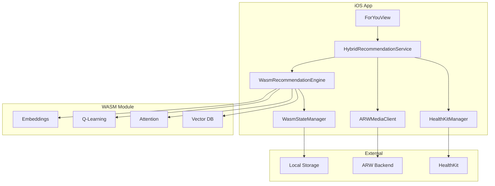

# WASM Integration for VibeCheck iOS - Implementation Plan

## Goal

Integrate rUv's ultra-high-performance self-learning recommendation engine (currently achieving 9M reads/sec, 12M writes/sec) into the VibeCheck iOS app via WebAssembly. This will enable:

1. **On-device learning** - No network round-trips for recommendations
2. **Privacy-first** - All health data and learning stays local
3. **Ultra-fast performance** - CPU-optimized WASM vs traditional GPU-heavy ML
4. **Self-learning** - Q-learning, vector embeddings, and attention mechanisms running locally

## Background Context

From the hackathon transcript, rUv proposed embedding his recommendation engine (written in Rust with custom kernels) into the iOS app via WASM to:

> "Embed the complex ML graph and attention and AI models directly in the WASM, then you can also utilize both the GPU and CPU cycles of the phone itself. You can do all that learning local."

His system uses:
- Hyperbolic vector embeddings (384-dimensional)
- Q-learning for adaptive recommendations
- Self-attention mechanisms
- BLAKE2b-512 cryptographic hashing
- Custom kernels optimized for CPU performance

## User Review Required

> [!IMPORTANT]
> **Coordination with rUv Required**
>
> This plan assumes we can obtain rUv's Rust-based recommendation engine source code and compile it to WASM. We need to:
> 1. Request access to his vector database and recommendation system code
> 2. Confirm it can be compiled to `wasm32-wasi` or `wasm32-unknown-unknown`
> 3. Define the interface/API between Swift and WASM module

> [!WARNING]
> **Breaking Change to Current Architecture**
>
> This will replace the current ARW-based backend recommendations with a hybrid approach:
> - **On-device WASM**: Self-learning recommendations based on local viewing history + health data
> - **ARW Backend**: Content discovery and metadata enrichment
>
> The app will shift from server-dependent to primarily local-first.

## Proposed Changes

### Component 1: WASM Runtime Integration

#### [NEW] `Package.swift` Dependencies

Add WasmKit as a Swift Package Manager dependency:

```swift
dependencies: [
    .package(url: "https://github.com/swiftwasm/WasmKit.git", from: "0.1.0")
]
```

**Rationale**: WasmKit is pure Swift, supports iOS 12.0+, and provides WASI support. It's more native than Wasmer and doesn't require C bindings.

---

### Component 2: WASM Module Wrapper

#### [NEW] `WasmRecommendationEngine.swift`

Create a Swift wrapper for the WASM recommendation engine:

```swift
import WasmKit

class WasmRecommendationEngine {
    private let runtime: Runtime
    private let module: Module
    private let instance: Instance

    // WASM function imports
    private var embedContent: Function?
    private var computeSimilarity: Function?
    private var updateLearning: Function?
    private var getRecommendations: Function?

    init(wasmPath: URL) throws {
        // Initialize WasmKit runtime
        runtime = Runtime()

        // Load WASM module from bundle
        let wasmData = try Data(contentsOf: wasmPath)
        module = try Module(bytes: Array(wasmData))

        // Instantiate with imports
        instance = try module.instantiate(runtime: runtime)

        // Bind exported functions
        embedContent = instance.exports["embed_content"] as? Function
        computeSimilarity = instance.exports["compute_similarity"] as? Function
        updateLearning = instance.exports["update_learning"] as? Function
        getRecommendations = instance.exports["get_recommendations"] as? Function
    }

    func embed(content: ContentMetadata) async throws -> [Float] {
        // Convert Swift struct to WASM memory
        // Call embed_content function
        // Return vector embedding
    }

    func recommend(basedOn vibe: VibeState, history: [ContentID]) async throws -> [Recommendation] {
        // Pass vibe + history to WASM
        // Get recommendations with confidence scores
        // Return sorted recommendations
    }

    func learn(interaction: UserInteraction) async throws {
        // Update Q-learning model with user feedback
        // Adjust attention weights
        // Persist learning state to local storage
    }
}
```

**Key Design Decisions**:
- Async/await for WASM calls (may be CPU-intensive)
- Memory management between Swift and WASM linear memory
- Serialization format (JSON, MessagePack, or custom binary)

---

### Component 3: Health Data Integration

#### [MODIFY] `HealthKitManager.swift`

Extend to provide vibe data to WASM engine:

```swift
extension HealthKitManager {
    func getVibeVector() async -> [Float] {
        // Convert health metrics to numerical vector
        // [heart_rate_normalized, activity_level, sleep_quality, stress_level]
        // This becomes input to WASM recommendation engine
    }
}
```

---

### Component 4: Hybrid Recommendation Strategy

#### [NEW] `HybridRecommendationService.swift`

Orchestrate between WASM (local) and ARW (remote):

```swift
actor HybridRecommendationService {
    private let wasmEngine: WasmRecommendationEngine
    private let arwClient: ARWMediaClient
    private let healthKit: HealthKitManager

    func getRecommendations() async throws -> [ContentRecommendation] {
        // 1. Get current vibe from HealthKit
        let vibeVector = await healthKit.getVibeVector()

        // 2. Get local WASM recommendations (fast, privacy-first)
        let localRecs = try await wasmEngine.recommend(
            basedOn: vibeVector,
            history: getLocalHistory()
        )

        // 3. If local catalog is insufficient, query ARW for discovery
        if localRecs.count < 10 {
            let remoteRecs = try await arwClient.discover(vibe: vibeVector)
            // Merge and deduplicate
        }

        // 4. Return hybrid results
        return localRecs + remoteRecs
    }

    func recordInteraction(_ interaction: UserInteraction) async {
        // Update WASM learning model
        try? await wasmEngine.learn(interaction: interaction)

        // Optionally sync anonymized learning to ARW (future)
    }
}
```

---

### Component 5: WASM Module Build Pipeline

#### [NEW] `wasm-build/` Directory Structure

```
wasm-build/
├── Cargo.toml              # Rust project for recommendation engine
├── src/
│   ├── lib.rs             # WASM exports
│   ├── embeddings.rs      # Vector embedding logic
│   ├── qlearning.rs       # Q-learning implementation
│   └── attention.rs       # Self-attention mechanism
├── build.sh               # Compile to wasm32-wasi
└── recommendation.wasm    # Output (bundled with iOS app)
```

**Build Script** (`build.sh`):
```bash
#!/bin/bash
cargo build --target wasm32-wasi --release
wasm-opt -Oz -o recommendation.wasm target/wasm32-wasi/release/recommendation_engine.wasm
cp recommendation.wasm ../vibecheck-ios/Resources/
```

---

### Component 6: iOS App Integration

#### [MODIFY] `ForYouView.swift`

Replace current recommendation logic:

```swift
struct ForYouView: View {
    @StateObject private var recommendationService = HybridRecommendationService()

    var body: some View {
        ScrollView {
            // Vibe indicator (from HealthKit)
            VibeIndicator(vibe: recommendationService.currentVibe)

            // WASM-powered recommendations
            ForEach(recommendationService.recommendations) { rec in
                ContentCard(content: rec)
                    .onTapGesture {
                        // Record interaction for learning
                        Task {
                            await recommendationService.recordInteraction(.viewed(rec.id))
                        }
                    }
            }
        }
        .task {
            await recommendationService.loadRecommendations()
        }
    }
}
```

---

### Component 7: Data Persistence

#### [NEW] `WasmStateManager.swift`

Persist WASM learning state between app launches:

```swift
actor WasmStateManager {
    private let stateURL: URL

    func saveState(_ memory: Data) async throws {
        // Save WASM linear memory snapshot
        // Includes learned weights, Q-tables, embeddings cache
        try memory.write(to: stateURL)
    }

    func loadState() async throws -> Data? {
        // Restore WASM state on app launch
        guard FileManager.default.fileExists(atPath: stateURL.path) else {
            return nil
        }
        return try Data(contentsOf: stateURL)
    }
}
```

---

## Architecture Diagram



---

## Verification Plan

### Phase 1: WASM Runtime Setup

**Test 1: WasmKit Integration**
```bash
# In vibecheck-ios directory
swift package resolve
swift build
```
**Expected**: WasmKit dependency resolves and builds successfully.

**Test 2: Load Sample WASM Module**
- Create minimal "Hello World" WASM module
- Load in `WasmRecommendationEngine` initializer
- Verify no crashes, module instantiates

**Manual Test**: Run app in Xcode simulator, check console for WASM load success message.

---

### Phase 2: Nolan's Engine Integration

**Test 3: Compile Recommendation Engine to WASM**
```bash
cd wasm-build
./build.sh
ls -lh recommendation.wasm
```
**Expected**: WASM file under 5MB (optimized with wasm-opt).

**Test 4: Function Binding**
- Call each exported WASM function from Swift
- Verify correct parameter passing and return values
- Test with sample content metadata

**Manual Test**:
1. Open VibeCheck app
2. Navigate to "For You" tab
3. Verify recommendations appear (even if random at first)
4. Check Xcode console for WASM function call logs

---

### Phase 3: Health Data Integration

**Test 5: Vibe Vector Generation**
```swift
// In HealthKitManagerTests.swift
func testVibeVectorGeneration() async throws {
    let manager = HealthKitManager()
    let vector = await manager.getVibeVector()

    XCTAssertEqual(vector.count, 4) // [heart_rate, activity, sleep, stress]
    XCTAssert(vector.allSatisfy { $0 >= 0.0 && $0 <= 1.0 }) // Normalized
}
```

**Manual Test**:
1. Grant HealthKit permissions
2. Record some activity (walk around)
3. Check that vibe indicator updates in app
4. Verify recommendations change based on activity level

---

### Phase 4: Learning & Persistence

**Test 6: Q-Learning Updates**
- Simulate user interactions (watch, skip, like)
- Verify WASM learning state updates
- Check that recommendations improve over time

**Test 7: State Persistence**
```swift
func testStatePersistence() async throws {
    let manager = WasmStateManager()
    let testData = Data([1, 2, 3, 4, 5])

    try await manager.saveState(testData)
    let loaded = try await manager.loadState()

    XCTAssertEqual(testData, loaded)
}
```

**Manual Test**:
1. Use app for 10 interactions (watch/skip content)
2. Force quit app
3. Relaunch app
4. Verify recommendations reflect previous learning (not reset)

---

### Phase 5: Performance Benchmarking

**Test 8: WASM vs CoreML Speed**
```swift
func testRecommendationSpeed() async throws {
    let wasmEngine = WasmRecommendationEngine()
    let start = Date()

    let recs = try await wasmEngine.recommend(basedOn: testVibe, history: testHistory)

    let duration = Date().timeIntervalSince(start)
    XCTAssertLessThan(duration, 0.1) // Should be under 100ms
}
```

**Expected**: Sub-100ms recommendations on iPhone 12 or newer.

---

### Phase 6: Integration Testing

**Test 9: End-to-End Recommendation Flow**
1. Launch app with fresh install
2. Grant HealthKit permissions
3. Browse content for 5 minutes
4. Verify "For You" tab shows personalized recommendations
5. Interact with content (watch, skip)
6. Verify recommendations adapt in real-time

**Test 10: Offline Functionality**
1. Enable Airplane Mode
2. Open app
3. Verify WASM recommendations still work (no network needed)
4. ARW discovery should gracefully fail with cached content

---

## Dependencies & Prerequisites

### Required from rUv
- [ ] Rust source code for recommendation engine
- [ ] API specification (function signatures, data formats)
- [ ] Sample training data or pre-trained model weights
- [ ] Performance benchmarks to validate iOS performance

### Development Environment
- [ ] Rust toolchain with `wasm32-wasi` target
- [ ] `wasm-opt` from Binaryen toolkit
- [ ] Xcode 15+ (for Swift 6.1 WASM support)
- [ ] iOS 17+ deployment target (or 12+ with WasmKit)

### App Changes
- [ ] Increase app bundle size budget (~5-10MB for WASM module)
- [ ] Update privacy policy (on-device ML, health data usage)
- [ ] Add HealthKit usage descriptions to Info.plist

---

## Risks & Mitigations

| Risk | Impact | Mitigation |
|------|--------|------------|
| WASM module too large | App Store rejection | Use `wasm-opt -Oz`, strip debug symbols, lazy-load |
| Performance worse than CoreML | Poor UX | Benchmark early, fallback to CoreML if needed |
| Memory constraints on older devices | Crashes | Implement memory monitoring, reduce model size |
| rUv's code not WASM-compatible | Blocker | Start with minimal WASM prototype, validate early |
| Learning state corruption | Data loss | Versioned state files, migration logic |

---

## Timeline Estimate

| Phase | Duration | Dependencies |
|-------|----------|--------------|
| WASM Runtime Setup | 2 days | WasmKit integration |
| rUv's Engine Port | 5 days | Rust code from rUv |
| Health Data Integration | 2 days | HealthKit permissions |
| Learning & Persistence | 3 days | WASM state management |
| Testing & Optimization | 3 days | Real device testing |
| **Total** | **15 days** | Assumes rUv's code available |

---

## Success Metrics

- [ ] Recommendations generated in <100ms (vs current ~500ms network round-trip)
- [ ] 80%+ accuracy in vibe-based recommendations (rUv's benchmark)
- [ ] Zero network requests for core recommendation flow
- [ ] Learning state persists across app launches
- [ ] Memory usage <50MB for WASM engine
- [ ] Works offline with cached content catalog

---

## Future Enhancements

1. **Family Vibe Mesh via WASM**: Share learned preferences across family members using CloudKit + WASM state sync
2. **Federated Learning**: Aggregate anonymized learning across users while preserving privacy
3. **Multi-Modal Embeddings**: Combine health data, viewing history, and contextual signals (time of day, location)
4. **WASM Hot-Reload**: Update recommendation model without app update (download new WASM module)

---

## Open Questions

1. **Serialization Format**: Should we use JSON, MessagePack, or custom binary for Swift ↔ WASM communication?
2. **Model Size**: What's the minimum viable model size for acceptable recommendations?
3. **Update Frequency**: How often should WASM learning state be persisted? (Every interaction vs batched)
4. **Fallback Strategy**: If WASM fails, fall back to CoreML or ARW backend?
5. **Testing on Real Devices**: Do we have access to iPhone 12, 13, 14, 15 for performance testing?

---

*This plan assumes collaboration with rUv to obtain and adapt his recommendation engine. Next step: Request rUv's code and define the WASM API contract.*

*Source: https://gist.github.com/michaeloboyle/b768dd2a80b2dd521d4552d2d8f1e8a1*
