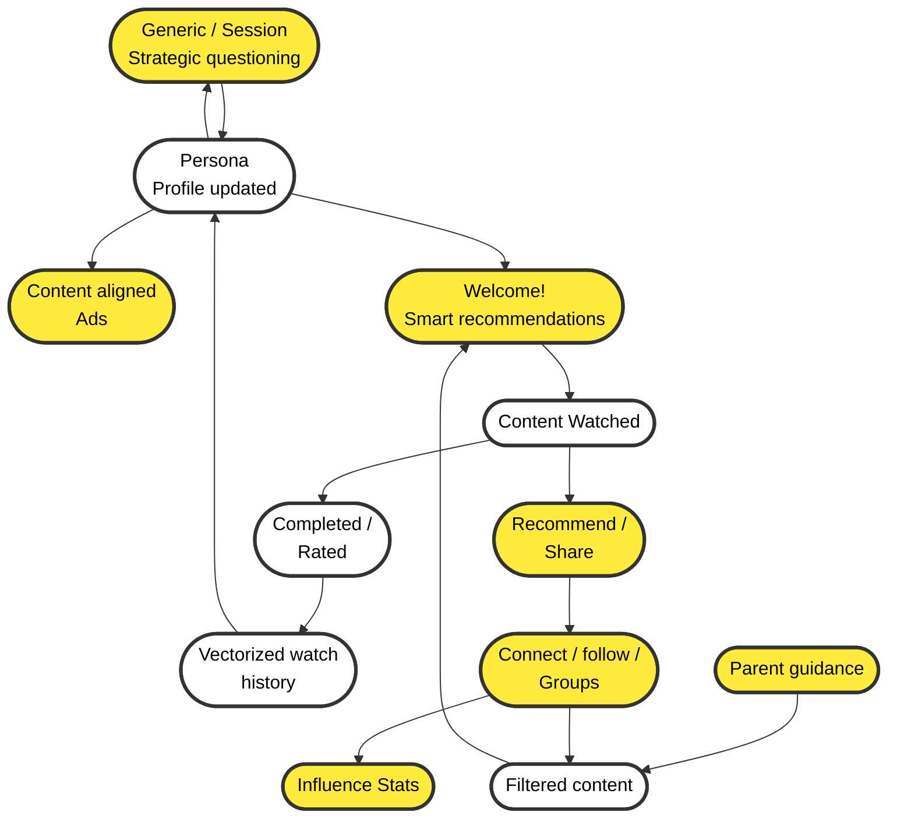

# Content Discovery System Flow Diagram

This diagram illustrates the multi-agent content discovery and recommendation system with competitive advantages highlighted.

## Mermaid Diagram

## Legend

🟨 **Yellow nodes** = Competitive advantage / Differentiator
⬜ **White nodes** = Normal system components

## System Flow Description

### Left Column (User Profile & Personalization)
1. **Generic/Session Strategic questioning** - Initial user understanding
2. **Persona (Profile updated)** - Centralized user profile
3. **Vectorized watch history** - ML-ready viewing data
4. **Content aligned Ads** - Personalized advertising

### Center Column (Content Pipeline)
1. **Filtered content** - Safety and preference-filtered content pool
2. **Welcome! Smart recommendations** - AI-powered recommendations
3. **Content Watched** - User viewing activity
4. **Completed/Rated** - Finished content with ratings
5. **Recommend/Share** - Social sharing features

### Right Column (Social & Safety)
1. **Parent guidance** - Content safety controls
2. **Connect/follow/Groups** - Social networking features
3. **Influence Stats** - Social influence metrics

## Competitive Advantages (Yellow Nodes)

1. **Strategic questioning** - Adaptive user profiling
2. **Smart recommendations** - AI-driven personalization
3. **Content aligned Ads** - Non-intrusive advertising
4. **Recommend/Share** - Viral growth mechanism
5. **Parent guidance** - Family-safe content filtering
6. **Connect/follow/Groups** - Social networking integration
7. **Influence Stats** - Gamification and engagement

## Key Feedback Loops

1. **Persona ↔ Strategic questioning** - Continuous profile refinement
2. **Content Watched → Rated → Watch history → Persona** - Learning loop
3. **Share → Groups → Filtered content** - Social discovery loop

---

**Created**: 2025-12-05
**Purpose**: System architecture visualization for multi-agent content discovery
