# Detailed User Flow & Development Flowcharts

## Complete System Flow: Selection → Viewing → Rating → Recommending

This document provides detailed flowcharts for every stage of the EntertainAI platform, from initial user interaction through the continuous improvement feedback loop.

---

## 1. User Journey Flow (Frontend)


---

## 2. Agent System Flow (Backend)

```mermaid
flowchart TD
    Trigger[User Submits Query] --> ParseInput[Parse Strategic Context]
    ParseInput --> ContextAgent[1. StrategicContextAgent<br/>Priority: 10]

    ContextAgent --> ExtractParams[Extract Parameters:<br/>- Viewing Context: Group<br/>- Energy: Intense<br/>- Duration: Movie<br/>- Query: action thriller]

    ExtractParams --> ParallelPhase1{Phase 1: Parallel}

    ParallelPhase1 -->|Thread 1| PersonaAgent[2a. PersonalizationAgent<br/>Priority: 8<br/>ON-DEVICE]
    ParallelPhase1 -->|Thread 2| MoodAgent[2b. MoodDetectionAgent<br/>Priority: 7<br/>ON-DEVICE]

    PersonaAgent --> LoadHistory[Load Watch History<br/>Encrypted Local Storage]
    LoadHistory --> BuildProfile[Build Temporary Profile:<br/>- Preferred genres<br/>- Avg rating patterns<br/>- Time of day preferences]

    MoodAgent --> ContextSignals[Analyze Context:<br/>- Time: 8pm Friday<br/>- Location: Home<br/>- Recent searches]
    ContextSignals --> MoodOutput[Output: Relaxed Evening Mode]

    BuildProfile --> Sync1[Sync Point 1]
    MoodOutput --> Sync1

    Sync1 --> ResearchAgent[3. ResearchAgent<br/>Priority: 7<br/>SERVER-SIDE]

    ResearchAgent --> QueryPlatforms[Query 5 Platforms via API:<br/>- Netflix<br/>- HBO Max<br/>- Disney+<br/>- Prime Video<br/>- Apple TV+]

    QueryPlatforms --> DiffPrivacy[Apply Differential Privacy:<br/>Add noise to query<br/>to anonymize user]

    DiffPrivacy --> FetchCandidates[Fetch 500+ Candidates<br/>matching criteria]

    FetchCandidates --> ParallelPhase2{Phase 2: Parallel}

    ParallelPhase2 -->|Thread 1| ReviewAgent[4a. ReviewAggregationAgent<br/>Priority: 6]
    ParallelPhase2 -->|Thread 2| TrendAgent[4b. TrendAnalysisAgent<br/>Priority: 6]
    ParallelPhase2 -->|Thread 3| SocialAgent[4c. SocialGraphAgent<br/>Priority: 9]

    ReviewAgent --> AggregateReviews[Aggregate Reviews:<br/>- IMDb<br/>- Rotten Tomatoes<br/>- Metacritic<br/>- Google Users]
    AggregateReviews --> ReviewScores[Generate Composite Scores]

    TrendAgent --> SocialSignals[Analyze Social Signals:<br/>- Twitter mentions<br/>- Reddit discussions<br/>- Google Trends]
    SocialSignals --> TrendScores[Calculate Trending Score]

    SocialAgent --> QueryGroups[Query User Groups:<br/>- Pizza Group<br/>- Work Friends<br/>- Family]
    QueryGroups --> GroupPrefs[E2EE Group Preferences<br/>What they watched/liked]

    ReviewScores --> Sync2[Sync Point 2]
    TrendScores --> Sync2
    GroupPrefs --> Sync2

    Sync2 --> FilterAgent[5. ContentFilterAgent<br/>Priority: 9]

    FilterAgent --> SafetyRules[Apply Safety Rules:<br/>- Age ratings<br/>- Content warnings<br/>- Blocked keywords]
    SafetyRules --> FilteredSet[Filtered Set: ~200 candidates]

    FilteredSet --> AnalysisAgent[6. AnalysisAgent<br/>Priority: 8<br/>ON-DEVICE]

    AnalysisAgent --> ScoreEach[Score Each Candidate:<br/>0-100 relevance score]
    ScoreEach --> RankingFormula[Ranking Formula:<br/>Score = 0.3×Persona Match +<br/>0.2×Review Score +<br/>0.2×Social Proof +<br/>0.15×Trending +<br/>0.15×Group Match]

    RankingFormula --> SortByScore[Sort by Score DESC]
    SortByScore --> TopN[Select Top 12]

    TopN --> RecommendAgent[7. RecommendationAgent<br/>Priority: 9]

    RecommendAgent --> GenerateReasoning[Generate AI Reasoning:<br/>Why each pick was selected]
    GenerateReasoning --> AttachMetadata[Attach Metadata:<br/>- Confidence %<br/>- Social proof<br/>- Tags<br/>- Reviews]

    AttachMetadata --> FinalOutput[Final Output:<br/>12 Personalized Recommendations]

    FinalOutput --> ReturnToUI[Return to UI<br/>Display Results]

    ReturnToUI --> LogPerf[Log Performance:<br/>Total time: 2.8s<br/>Candidates processed: 500<br/>ON-DEVICE]

    style PersonaAgent fill:#8B5CF6,color:#fff
    style MoodAgent fill:#8B5CF6,color:#fff
    style AnalysisAgent fill:#8B5CF6,color:#fff
    style ResearchAgent fill:#3B82F6,color:#fff
    style LogPerf fill:#22C55E,color:#fff
```



---

## 3. Rating & Feedback Flow

```mermaid
flowchart TD
    WatchComplete[User Finishes Watching] --> CaptureMetrics[Capture Watch Metrics<br/>ON-DEVICE ONLY]

    CaptureMetrics --> Metrics[Metrics Captured:<br/>- Watch duration: 87%<br/>- Pause count: 2<br/>- Completion: Full<br/>- Timestamp: 2024-12-06 10:45pm]

    Metrics --> PromptUser{Show Rating<br/>Prompt?}

    PromptUser -->|Yes - Finished| RatingUI[Rating Interface]
    PromptUser -->|No - Abandoned| ImplicitOnly[Use Implicit Signals Only]

    RatingUI --> StarRating[Star Rating: 1-5⭐]
    StarRating --> OptionalTags{Add Optional<br/>Feedback Tags?}

    OptionalTags -->|Yes| SelectTags[Select Tags:<br/>□ Too Slow<br/>□ Confusing Plot<br/>☑ Great Acting<br/>☑ Perfect Length<br/>□ Predictable]
    OptionalTags -->|No| SkipTags[Skip Tags]

    SelectTags --> CombineData
    SkipTags --> CombineData[Combine All Data]
    ImplicitOnly --> CombineData

    CombineData --> FeedbackPackage[Create Feedback Package:<br/>- Explicit: 4⭐<br/>- Tags: Great Acting, Perfect Length<br/>- Implicit: 87% watched, 2 pauses<br/>- Context: Friday 10pm, Solo viewing]

    FeedbackPackage --> StoreLocal[Store in Local Encrypted DB<br/>ON-DEVICE ONLY]

    StoreLocal --> UpdatePersona[Update Persona Vector:<br/>Increase weight for:<br/>- Drama genre<br/>- Strong performances<br/>- 90-120min duration]

    UpdatePersona --> AdjustWeights[Adjust ML Model Weights<br/>Using Federated Learning]

    AdjustWeights --> PrivacyCheck{Share Aggregated<br/>Data?}

    PrivacyCheck -->|User Opted In| Anonymize[Anonymize & Aggregate:<br/>Remove all PII<br/>Add differential privacy noise]
    PrivacyCheck -->|User Opted Out| SkipShare[Skip Server Upload]

    Anonymize --> SendGradients[Send ONLY Gradients:<br/>No raw data<br/>No watch history<br/>Only model improvements]

    SendGradients --> ServerML[Server: Federated Learning<br/>Aggregate gradients from<br/>1000+ users]

    ServerML --> ImproveModel[Improve Global Model:<br/>Better recommendations<br/>for all users]

    ImproveModel --> PushUpdate[Push Model Update<br/>to Devices]

    PushUpdate --> DeviceUpdate[Device: Update Local Model<br/>Improved accuracy]

    SkipShare --> LocalOnly[Local Improvements Only]
    LocalOnly --> NextRec
    DeviceUpdate --> NextRec[Next Recommendation Session<br/>Better Results]

    NextRec --> ImprovedResults[15% Better Match Score<br/>Thanks to Feedback Loop]

    style StoreLocal fill:#8B5CF6,color:#fff
    style UpdatePersona fill:#F59E0B,color:#fff
    style SendGradients fill:#22C55E,color:#fff
    style ImprovedResults fill:#E11D48,color:#fff
```



---

## 4. Social Sharing & Group Dynamics Flow

```mermaid
flowchart TD
    UserAction[User Clicks Share] --> SelectGroup[Select Target Group:<br/>□ Pizza Group<br/>☑ Work Friends<br/>□ Family]

    SelectGroup --> AddMessage{Add Optional<br/>Message?}

    AddMessage -->|Yes| TypeMessage[Type Message:<br/>Just watched this,<br/>you'll love it!]
    AddMessage -->|No| DefaultMessage[Use Default:<br/>Recommended The Last of Us]

    TypeMessage --> SharePackage
    DefaultMessage --> SharePackage[Create Share Package]

    SharePackage --> E2EE[End-to-End Encrypt:<br/>Only group members can decrypt]

    E2EE --> SendToGroup[Send to Group Activity Feed]

    SendToGroup --> GroupFeed[Group Activity Feed:<br/>Private Set Intersection<br/>Server learns nothing]

    GroupFeed --> NotifyMembers[Notify Group Members:<br/>Push notification<br/>if enabled]

    NotifyMembers --> MemberView{Member Opens<br/>Notification?}

    MemberView -->|Yes| DecryptShare[Decrypt Share<br/>on Member's Device]
    MemberView -->|No| QueuedNotif[Queued in Activity Feed]

    DecryptShare --> ViewRecommendation[View Recommendation:<br/>+ Friend's message<br/>+ Content details<br/>+ Why they liked it]

    ViewRecommendation --> MemberAction{Member Action}

    MemberAction -->|Add to List| AddToMyList[Add to My List]
    MemberAction -->|Watch Now| WatchContent[Watch Content]
    MemberAction -->|React| ReactToShare[React: 👍❤️🔥]
    MemberAction -->|Comment| CommentOnShare[Add Comment]

    AddToMyList --> UpdateInfluence
    WatchContent --> UpdateInfluence
    ReactToShare --> E2EEReaction[E2EE Reaction<br/>Send back to sharer]
    CommentOnShare --> E2EEComment[E2EE Comment<br/>Group thread]

    E2EEReaction --> NotifySharer[Notify Original Sharer]
    E2EEComment --> NotifySharer

    NotifySharer --> UpdateInfluence[Update Influence Score:<br/>Sarah's recommendations<br/>have 87% accept rate]

    UpdateInfluence --> WeightFuture[Weight Future Recommendations:<br/>Boost content Sarah likes<br/>in my feed by 20%]

    WeightFuture --> GroupDynamics[Analyze Group Dynamics:<br/>- Pizza Group: Comedy bias<br/>- Work Friends: Prestige drama<br/>- Family: Feel-good content]

    GroupDynamics --> SmartGroupRec[Smart Group Recommendations:<br/>When user selects Group viewing<br/>blend individual + group preferences]

    SmartGroupRec --> FindOverlap[Find Overlap:<br/>Content all members<br/>would enjoy]

    FindOverlap --> ConsensusScore[Calculate Consensus Score:<br/>Min 75% approval from group]

    ConsensusScore --> SuggestToGroup[Suggest to Group:<br/>Perfect for Friday night<br/>Pizza Group watch party!]

    style E2EE fill:#8B5CF6,color:#fff
    style GroupDynamics fill:#22C55E,color:#fff
    style ConsensusScore fill:#E11D48,color:#fff
```



---

## 5. Development Implementation Flow

```mermaid
flowchart TD
    Start([Development Start]) --> Phase1[Phase 1: Frontend Foundation]

    Phase1 --> UI1[Build Core UI Components:<br/>- Header<br/>- SearchSection<br/>- AgentActivity<br/>- RecommendationSection<br/>- RecommendationCard]

    UI1 --> UI2[Implement State Management:<br/>React Context or Zustand]

    UI2 --> UI3[Add Mock Data Pipeline:<br/>12 sample recommendations]

    UI3 --> UI4[Test Responsive Design:<br/>Mobile, Tablet, Desktop]

    UI4 --> Phase2[Phase 2: Agent System]

    Phase2 --> Agent1[Implement Agent Orchestrator:<br/>Manages 8 agent lifecycle]

    Agent1 --> Agent2[Build Individual Agents:<br/>Each with execute() method]

    Agent2 --> Agent3[Implement Parallel Execution:<br/>asyncio.gather() for phases]

    Agent3 --> Agent4[Add Priority Queue:<br/>Process agents by priority]

    Agent4 --> Agent5[Integrate Shared Memory:<br/>Agents communicate via memory]

    Agent5 --> Phase3[Phase 3: Data Integration]

    Phase3 --> Data1[Set Up Platform APIs:<br/>Netflix, HBO, Disney+, etc.]

    Data1 --> Data2[Implement Review Aggregation:<br/>IMDb, RT, Metacritic scrapers]

    Data2 --> Data3[Add Social Signals:<br/>Twitter API, Reddit API]

    Data3 --> Data4[Build Content Database:<br/>PostgreSQL with vector search]

    Data4 --> Phase4[Phase 4: Privacy Architecture]

    Phase4 --> Privacy1[Implement On-Device Storage:<br/>Encrypted IndexedDB for web<br/>Core Data for iOS<br/>Room for Android]

    Privacy1 --> Privacy2[Build Persona Engine:<br/>Runs 100% on device]

    Privacy2 --> Privacy3[Add Differential Privacy:<br/>Noise injection for queries]

    Privacy3 --> Privacy4[Implement Federated Learning:<br/>Gradient-only uploads]

    Privacy4 --> Privacy5[E2EE Social Features:<br/>Signal Protocol for groups]

    Privacy5 --> Phase5[Phase 5: API Layer]

    Phase5 --> API1[Build REST API:<br/>Express.js + TypeScript]

    API1 --> API2[Implement GraphQL:<br/>For flexible queries]

    API2 --> API3[Add Rate Limiting:<br/>Prevent abuse]

    API3 --> API4[Set Up Caching:<br/>Redis for hot content]

    API4 --> Phase6[Phase 6: Testing]

    Phase6 --> Test1[Unit Tests:<br/>Jest for components<br/>Pytest for agents]

    Test1 --> Test2[Integration Tests:<br/>Test agent workflows<br/>end-to-end]

    Test2 --> Test3[E2E Tests:<br/>Cypress for UI flows]

    Test3 --> Test4[Performance Tests:<br/>Load testing with k6<br/>Target: <3s response]

    Test4 --> Test5[Security Audit:<br/>OWASP Top 10 checks<br/>Privacy review]

    Test5 --> Phase7[Phase 7: Deployment]

    Phase7 --> Deploy1[Set Up CI/CD:<br/>GitHub Actions]

    Deploy1 --> Deploy2[Deploy Frontend:<br/>Vercel or Netlify]

    Deploy2 --> Deploy3[Deploy Backend:<br/>AWS ECS or Railway]

    Deploy3 --> Deploy4[Set Up Monitoring:<br/>Sentry for errors<br/>DataDog for metrics]

    Deploy4 --> Deploy5[Configure CDN:<br/>CloudFlare for assets]

    Deploy5 --> Phase8[Phase 8: Analytics]

    Phase8 --> Analytics1[Privacy-First Analytics:<br/>Plausible or Fathom<br/>NO Google Analytics]

    Analytics1 --> Analytics2[Track Key Metrics:<br/>- Avg recommendation time<br/>- Click-through rate<br/>- User satisfaction score<br/>- Agent performance]

    Analytics2 --> Analytics3[A/B Testing Framework:<br/>Test different algorithms]

    Analytics3 --> Phase9[Phase 9: Iteration]

    Phase9 --> Iterate1[Collect User Feedback]
    Iterate1 --> Iterate2[Analyze Performance Data]
    Iterate2 --> Iterate3[Tune Agent Weights]
    Iterate3 --> Iterate4[Improve ML Models]
    Iterate4 --> Iterate5[Deploy Updates]
    Iterate5 --> Iterate1

    style Phase1 fill:#E11D48,color:#fff
    style Phase4 fill:#8B5CF6,color:#fff
    style Phase7 fill:#22C55E,color:#fff
    style Analytics1 fill:#F59E0B,color:#fff
```

---

## 6. Privacy-First Data Flow

```mermaid
flowchart LR
    User[User Device] -->|1. Strategic Query| OnDevice[ON-DEVICE PROCESSING]

    OnDevice -->|2. Encrypted Local Storage| PersonaData[(Persona Vector<br/>Watch History<br/>Preferences)]

    PersonaData -->|3. Build Profile| PersonaAgent[PersonalizationAgent<br/>🔒 LOCAL ONLY]

    PersonaAgent -->|4. Anonymized Query| PrivacyLayer[Privacy Layer<br/>Differential Privacy]

    PrivacyLayer -->|5. Noisy Query| Server[Server APIs]

    Server -->|6. Content Candidates| FilterAgent[Content Filter<br/>Server-side]

    FilterAgent -->|7. Safe Candidates| BackToDevice[Return to Device]

    BackToDevice -->|8. Final Ranking| LocalRanking[AnalysisAgent<br/>🔒 LOCAL ONLY]

    LocalRanking -->|9. Top 12 Picks| Display[Display to User]

    Display -->|10. User Watches| WatchMetrics[Capture Metrics<br/>🔒 LOCAL ONLY]

    WatchMetrics -->|11. Feedback| LocalUpdate[Update Local Persona<br/>🔒 NEVER LEAVES DEVICE]

    LocalUpdate -->|12. Opt-In Only| FederatedLearning{User Consented<br/>to Improve System?}

    FederatedLearning -->|Yes| Gradients[Send ONLY Gradients<br/>No Raw Data]
    FederatedLearning -->|No| StayLocal[All Data Stays Local]

    Gradients -->|13. Encrypted Upload| ServerML[Server ML Training]

    ServerML -->|14. Improved Model| ModelUpdate[Push Model Update<br/>to All Devices]

    ModelUpdate --> OnDevice

    StayLocal --> OnDevice

    style PersonaAgent fill:#8B5CF6,color:#fff
    style LocalRanking fill:#8B5CF6,color:#fff
    style LocalUpdate fill:#8B5CF6,color:#fff
    style PrivacyLayer fill:#22C55E,color:#fff
```



---

## 7. Complete End-to-End User Story Example

**Scenario:** Sarah wants to watch something on Friday night with her roommate

### Step-by-Step Flow:

1. **Landing (0:00)**
   - Opens EntertainAI app at 8:00 PM Friday
   - Sees "What's the plan tonight?" hero section

2. **Strategic Questions (0:00-0:15)**
   - Q1: Selects "Group" (watching with roommate)
   - Q2: Sets Energy Level slider to "Intense" (wants action)
   - Q3: Selects "Movie" (2-hour duration)
   - Optional: Adds search query "strong female lead"

3. **Agent Execution (0:15-3:00)**
   - **StrategicContextAgent** (0.0-0.4s): Parses constraints
   - **PersonalizationAgent** (0.3-0.8s): Loads Sarah's watch history (on-device)
     - Finds: Loves action thrillers, 4.5⭐ avg for female-led films
   - **MoodDetectionAgent** (0.3-0.8s): Analyzes context (Friday evening, home)
   - **ResearchAgent** (0.8-1.3s): Queries 5 platforms with anonymized request
     - Finds 487 candidates matching criteria
   - **ReviewAggregationAgent** (1.5-2.1s): Scrapes IMDb, RT, Metacritic
   - **TrendAnalysisAgent** (1.5-2.1s): Checks social signals
   - **SocialGraphAgent** (1.5-2.1s): Queries "Pizza Group" preferences (E2EE)
   - **ContentFilterAgent** (2.1-2.6s): Filters for age rating, content warnings
   - **AnalysisAgent** (2.2-2.7s): Ranks 200 filtered candidates (on-device)
   - **RecommendationAgent** (2.7-2.8s): Generates top 12 with reasoning

4. **Results Display (3:00)**
   - Shows 12 personalized recommendations
   - Top pick: "Everything Everywhere All At Once" - 98% Match
     - Confidence: Very High
     - Social Proof: "Sarah & Mike from Pizza Group watched"
     - Tags: 🔥 Trending, ⭐ Critics' Choice

5. **Selection (3:00-3:30)**
   - Sarah clicks "Why this pick?"
   - AI Reasoning expands:
     > "Strategic match: Fits your 'Intense' energy and 'Group' viewing. Female-led action-comedy matching your high ratings for similar films. Your Pizza Group gave it 4.8⭐ average."

6. **Action (3:30)**
   - Clicks "Play Now"
   - Redirects to A24 / streaming platform

7. **Viewing (3:30-5:30)**
   - Watches full movie (2 hours)
   - System captures (on-device):
     - Watch duration: 100%
     - Pause count: 1 (bathroom break)
     - Completion: Full
     - Context: Group viewing, Friday 8-10pm

8. **Rating (5:30-5:45)**
   - App prompts: "How was Everything Everywhere All At Once?"
   - Sarah rates: 5⭐
   - Adds tags: "Perfect Length", "Great Acting", "Mind-Blowing"
   - Roommate also rates: 4⭐ with tag "Confusing at times"

9. **Feedback Processing (5:45)**
   - **On-Device:**
     - Updates Sarah's persona vector:
       - ↑ Weight for multiverse/sci-fi
       - ↑ Weight for A24 films
       - ↑ Weight for Michelle Yeoh
     - Stores encrypted feedback locally
   - **Federated Learning (Opt-In):**
     - Anonymizes: "User liked female-led action-comedy, 5⭐"
     - Adds noise: Differential privacy
     - Sends only gradients (no raw data) to server

10. **Social Sharing (5:50)**
    - Sarah clicks "Share with Work Friends"
    - Types: "Just watched this with my roommate - absolutely incredible! 🤯"
    - E2EE encrypts message
    - Sends to group feed via Private Set Intersection

11. **Group Impact (Next Day)**
    - Work Friends see Sarah's recommendation
    - 3 members add to their lists
    - 1 member watches and rates 5⭐
    - Sarah's influence score increases: 87% → 89%
    - System learns: Weight Sarah's action picks higher for Work Friends group

12. **Next Session (Next Friday)**
    - Sarah opens app again
    - Strategic Questions remember context
    - Agent system now knows:
      - ✅ Loves A24 films
      - ✅ Prefers 2-hour movies
      - ✅ Friday nights = Group viewing
      - ✅ Intense energy preference
    - Recommendations are 15% more accurate
    - Top pick: "Hereditary" (A24, horror-thriller, female-led)
      - Confidence: 96% Match
      - Reasoning: "Based on your 5⭐ rating of EEAAO and preference for intense, mind-bending A24 films"

---

## 8. Performance Benchmarks

| Stage | Target Time | Privacy Level |
|-------|-------------|---------------|
| Strategic Questions | Instant | N/A |
| Agent Execution | <3 seconds | Mixed |
| ├─ On-Device Agents | 0.5s | 🔒 Private |
| ├─ Server Agents | 2.0s | 🌐 Anonymized |
| └─ Final Ranking | 0.3s | 🔒 Private |
| Results Display | Instant | N/A |
| Rating Capture | Instant | 🔒 Private |
| Persona Update | <0.1s | 🔒 Private |
| Federated Learning | Background | 🌐 Gradients Only |

---

## 9. Privacy Guarantees Summary

### ✅ Data That NEVER Leaves Device:
- Complete watch history
- Persona vector (preferences, ratings)
- Strategic question answers
- Explicit ratings and feedback tags
- Viewing context (time, location, duration)

### 🌐 Data Sent to Server (Anonymized):
- Generic content queries with differential privacy noise
- Aggregated model gradients (federated learning, opt-in only)
- Public review scores (IMDb, RT - not user-specific)

### 🔒 End-to-End Encrypted (Group Features):
- Social recommendations to friends
- Group chat messages
- Watch party invitations
- Influence scores (only group members can decrypt)

---

## 10. Key Metrics to Track

### User Experience:
- Time to first recommendation: <3s
- Recommendation acceptance rate: >40%
- User satisfaction score: >4.2/5
- Daily active users retention: >60% at 30 days

### System Performance:
- Agent execution time: <3s (95th percentile)
- API response time: <500ms (95th percentile)
- On-device storage: <50MB
- Federated learning bandwidth: <1MB/month

### Privacy Compliance:
- Data on-device: 100% of personal data
- Server queries anonymized: 100%
- User consent rate: Track opt-in %
- Zero personal data breaches: 100%

---

**Document Version:** 1.0
**Last Updated:** 2024-12-06
**Status:** Hackathon Specification
